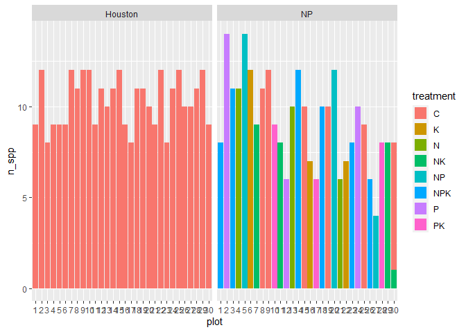
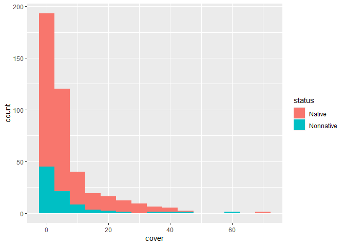

# Thorne_EDA-22

Gabriella Ruiz, Chani Thorne Department, Minnesota State University
Moorhead, 1104 7th Avenue South, Moorhead, MN 56563

## How does species richness vary in native restored prairies when NPK fertilizer treatments are applied

The Minnesota State University of Moorhead Regional Science Center has
two established restored prairie sites: North Pond and Houston. We will
be using exploratory data analysis to compare percent cover and taxa
data from both sites to look at the variation of species richness.
Previous studies on native and restored prairies have shown that
anthropogenic influences on the environment fuel the growth of invasive
species (MacDougall et al. 2014). We expect to find that plots with
applied NPK fertilizer will have a lower overall species richness than
plots with no nutrients applied. A greater understanding of these
processes and consequent environmental impacts may provide a useful
background of knowledge for land management, restoration, and
conservational efforts.

## Introduction

The Nutrient Network (NutNet) is a global research collaborative started
by the University of Minnesota (U of M) with the intent to study the
effects of nutrient deposition in grasslands asking this main research
question: How are the productivity and diversity of plant species
impacted by the addition of nutrients? MSUM is in its sixth year of
enrollment with the network, as we established a NutNet site at the MSUM
Regional Science Center (RSC). This site, called North Pond (NP), is
located on an older prairie restoration. We are required to follow the
research protocols as outlined by the network and submit our data to the
U of M. The Houston site was originally intended to be enrolled in the
network as our second location, but the decision was made to not enroll
it due to the results that we have seen at North Pond. The concern was
that nutrient additives of NPK would fuel the growth of invasive species
and disrupt the development of this prairie restoration. Instead, we are
using Houston for independent student research projects. Research
projects that will be conducted this year include: eDNA metabarcoding
Focal species morphology across three sites Dormant vs. non-dormant lead
plant seeding Analyzing and mapping species diversity

## Methods

According to NutNet protocols (Nutrient Network 2016), each NutNet site
is split into three blocks, each with 10 5x5 m plots for a total of 30
plots. Factorial combinations of nutrients (Nitrogen, Phosphorus, and
Potassium - NPK) were added for the fifth year to designated 5x5 m plots
in the spring. The Houston site follows the same protocols for 5x5 m
plot design as well, but does not receive the fertilizer treatment. We
measured species diversity and species abundance using NutNet protocols
for both sites (Nutrient Network 2016): Data analysis was completed
using R Studio software and the TidyVerse package, as well at the
GoogleSheets4 package to allow us to read in data from external sources.

## Results

<!-- -->

Fig. 1 Comparison of plant species richness between untreated plots,
Houston (left) and NPK treated plots, North Pond (right) 2021.

<!-- -->

Fig. 2 Comparison of plant species richness between untreated plots,
Houston (left), and NPK treated plots, North Pond (right) 2018.

    ## Warning: Removed 1 rows containing non-finite values (stat_bin).

<!-- -->

Fig. 3. Histogram comparing the percent cover of a native or non-native
species counts in a given plot from data collected in 2021.

    ## Warning: Removed 1 rows containing missing values (geom_point).

<!-- -->

Fig. 4. Mean cover of native and non-native plant species and 95%
confidence interval of data collection.

Our results (Fig. 1, Fig. 2) show a greater consistency between control plots than seen in N,P,K plots. This suggests that control plots, even when they contain a lower species richness, have a lower presence of invasive species than NPK plots. This supports the study mentioned in the abstract- that anthropogenic influences on the environment increase the growth of invasive species (Macdougall et al. 2014).In Figure 3 we see that there is a greater number of native species throughout he NP and Houston sites which have small percent cover rates among most plots. This suggests that native species have lower density and are spread out among plots more. We can see a similar trend with the non-native spices as well. We can also determine that, on average, native species have a slightly higher percent cover than non-native species, and that the native species are more consistently dispersed than non-natives are across plots (Fig. 4).

## Discussion

Nutrient deposition and runoff often contaminate the surrounding area of
application. A study completed on the effects of urbanization on species
richness showed that under circumstances of urbanization, species
richness almost always decreases (McKinney 2008). This, paired with our
results that have shown a higher average species richness in control
plots as compared to plots with NPK additives, could implicate that as
urban growth and sprawl increase, we will see a decrease of native
species richness as more land is maintained with chemical control
including fertilizers, herbicides, and pesticides. There is also
evidence that suggests that the use of NPK fertilizers could increase
the amount of exotic species richness, thus decreasing the number of
native species richness in prairie landscapes (Seableem 2013). However,
at Houston, there were 7 plots with the same species richness of 5
species in the 1 meter square sampling subplot. Three of these plots
contained only native species, and the other four only contained a
single invasive species. This suggests that control plots, even when
they contain a lower species richness, have a lower presence of invasive
species than NPK plots. This supports the study mentioned in the
abstract- that anthropogenic influences on the environment increase the
growth of invasive species (Macdougall et al. 2014).

## References

Nutrient Network: A Global Research Cooperative. 2016. Retrieved from
<http://www.nutnet.org/exp_protocol>.

MacDougall AS, Bennett JR, Firn J, et al. 2014. Anthropogenic-based
regional-scale factors most consistently explain plot-level exotic
diversity in grasslands. Global Ecology and Biogeography. 23(7):802–810.
<doi:10.1111/geb.12157>.

McKinney ML. 2008. Effects of urbanization on species richness: A review
of plants and animals. Urban Ecosystems. 11(2):161–176.
<doi:10.1007/s11252-007-0045-4>.

Seabloom, Eric W., et al. “Predicting Invasion in Grassland Ecosystems:
Is Exotic Dominance the Real Embarrassment of Richness?” Global Change
Biology, vol. 19, no. 12, 2013, pp. 3677–3687.,
<https://doi.org/10.1111/gcb.12370>.

## Acknowledgements

Field work was funded by a MSUM Strong Summer Scholars grant awarded to
Tyler Edvall, Gabriella Ruiz, Jake Pundsack, Jwan Al Selim, and Katie
Olson in 2021. Assistance was provided by Elise Bakke and Dr. Alison
Wallace.

## Including Code

You can include R code in the document as follows:

    ##      speed           dist       
    ##  Min.   : 4.0   Min.   :  2.00  
    ##  1st Qu.:12.0   1st Qu.: 26.00  
    ##  Median :15.0   Median : 36.00  
    ##  Mean   :15.4   Mean   : 42.98  
    ##  3rd Qu.:19.0   3rd Qu.: 56.00  
    ##  Max.   :25.0   Max.   :120.00

## Including Plots

You can also embed plots, for example:

<!-- -->

Note that the `echo = FALSE` parameter was added to the code chunk to
prevent printing of the R code that generated the plot.
